# 🚀 Panduan Operasional: Otomatisasi Ground Check (DIRGC)

Panduan ini dirancang untuk alur kerja yang **berulang**. Anda cukup melakukan setup sekali, dan selanjutnya hanya perlu "Drop File Excel & Run".

## 📊 Alur Kerja (Sequence Diagram)

```mermaid
sequenceDiagram
    autonumber
    actor User as 👤 Operator
    participant Folder as 📂 Folder Data
    participant App as 🤖 Bot/Aplikasi
    participant Web as 🌐 MatchaPro (Web)
    participant Log as 📝 File Log

    Note over User, Folder: Tahap Persiapan
    User->>Folder: 1. Simpan Excel Baru (misal: Tahap2.xlsx)
    
    Note over User, App: Tahap Eksekusi
    User->>App: 2. Jalankan Aplikasi (GUI/CLI)
    App->>Folder: 3. Baca File Excel
    
    rect rgb(20, 20, 20)
        Note left of Web: Mode Penyamaran (Stealth Android)
        App->>Web: 4. Login Otomatis (via Config)
        Web-->>App: 5. Akses Diterima (Dashboard)
    end
    
    loop Untuk Setiap Baris Data
        App->>Web: 6. Search (ID SBR)
        alt Data Ditemukan
            App->>Web: 7. Klik Hasil -> Isi Form -> Submit
            Web-->>App: 8. Konfirmasi Sukses
            App->>Log: 9. Catat Status: "Berhasil"
        else Data Tidak Ditemukan/Error
            App->>Log: 10. Catat Status: "Gagal/Skipped"
        end
    end
    
    App-->>User: 11. Proses Selesai (Tampilkan Notifikasi)
    User->>Log: 12. Cek Hasil Pengerjaan (Excel Log)
```



---

## 🛠️ Tahap 1: Persiapan Awal (Hanya Sekali)

Sebelum mulai rutin, pastikan "senjata" Anda lengkap.

### 1. Siapkan Kredensial (Auto-Login)
Agar tidak perlu mengetik password setiap kali run, buat file konfigurasi.
1. Masuk ke folder `config` di dalam project.
2. Buat file baru bernama `credentials.json`.
3. Isi dengan format berikut (ganti dengan akun SSO BPS Anda):

   ```json
   {
     "username": "nip_atau_email_sso_anda",
     "password": "password_sso_anda"
   }
   ```
   *Note: File ini aman ada di komputer lokal Anda dan di-ignore oleh git.*

### 2. Install Dependencies
Pastikan environment siap (jika belum pernah dijalankan, jalankan di powershell):
```powershell
pip install -r requirements.txt
playwright install chromium
$env:Path = [System.Environment]::GetEnvironmentVariable("Path","Machine") + ";" + [System.Environment]::GetEnvironmentVariable("Path","User")
```

---

## 🔄 Tahap 2: Rutinitas (Saat Ada File Excel Baru)

Setiap ada penugasan atau file Excel baru, ikuti langkah ini:

### 1. Standarisasi File Excel
Pastikan file Excel baru Anda memiliki header kolom yang dikenali oleh Bot.
Bot membaca kolom berikut (Case Insensitive):
*   **Wajib:** `idsbr`
*   **Opsional (untuk validasi):** `nama_usaha`, `alamat`
*   **Wajib (Hasil Lapangan):** `hasil_gc` (Kode: 0=Tdk Ada, 1=Ada, 3=Tutup, 4=Ganda)
*   **Geotag:** `latitude`, `longitude`

**Tips:** Simpan file Excel baru ke dalam folder `data/` agar rapi, misal: `data/Batch_Januari_2.xlsx`.

### 2. Jalankan Bot (Pilih Salah Satu Cara)

#### Cara A: Menggunakan GUI (Lebih Mudah)
Cocok jika Anda ingin memilih file lewat tampilan visual.

1. Buka terminal di folder project, jalankan:
   ```bash
   python run_dirgc_gui.py
   ```
2. Klik tombol **Pilih Excel** -> Arahkan ke file baru di folder `data`.
3. Pastikan checkbox "Use Saved Credentials" tercentang.
4. Klik **Start**.

#### Cara B: Menggunakan CLI (Lebih Cepat/Power User)
Cocok jika Anda ingin membatasi baris (misal: hanya baris 1 s.d 50 dulu untuk tes).

```bash
# Contoh: Menjalankan file baru untuk 100 baris pertama
python run_dirgc.py --excel-file data/Batch_Januari_2.xlsx --start 1 --end 100
```

### 3. Monitoring
*   Biarkan jendela browser terbuka (Jangan di-minimize total, biarkan di background).
*   Bot akan bekerja sendiri.
*   Jika ada *capture* (OTP), bot akan berhenti sejenak menunggu Anda input manual di browser, lalu lanjut otomatis.

---

## ✅ Tahap 3: Verifikasi Hasil

Setelah bot selesai berhenti:

1. Buka folder `logs/YYYYMMDD/` (Folder dibuat otomatis sesuai tanggal hari ini).
2. Buka file Excel log terakhir (cth: `run1_1030.xlsx`).
3. Filter kolom **Status**:
   *   **Berhasil**: Aman.
   *   **Gagal/Error**: Cek kolom catatan (mungkin ID SBR salah, atau sinyal putus).
   *   **Skipped**: Data duplikat atau sudah GC.

---

## 🆘 Tahap 4: Strategi Recovery (Lanjut dari Gagal)

Seringkali VPN putus atau web maintenance saat proses berjalan. Karena bot saat ini disetting untuk "pantang menyerah" (terus mencoba), ini bisa membuang waktu.

### Solusi Cerdas: Lanjut "Estafet"

Anda **TIDAK PERLU** memilah data manual satu per satu dari file asli. Gunakan fitur tersembunyi aplikasi ini: **Log Kompatibel**.

**Konsep:** Output Log (Excel) yang dihasilkan bot memiliki struktur kolom yang **bisa dibaca kembali** oleh bot sebagai input.

**Langkah-langkah:**

1. **Stop Paksa** jika error beruntun (tutup window GUI atau Ctrl+C di terminal).
2. Buka folder `logs/YYYYMMDD/`.
3. Buka file Log terakhir (misal: `run1_0800.xlsx`).
4. **Filter & Bersihkan**:
   - Filter kolom `status`: Hapus centang `berhasil`. (Sisakan `error`, `gagal`, `skipped`).
   - Copy data sisa ini ke file Excel baru (misal: `Sisa_Gagal.xlsx`).
   - > *Pastikan header kolom (`idsbr`, `nama_usaha`, `alamat`, `keberadaanusaha_gc`) ikut ter-copy. Bot akan otomatis mengenali kolom `keberadaanusaha_gc` sebagai `hasil_gc`.*
5. **Jalankan Bot Lagi** dengan input `Sisa_Gagal.xlsx`.

Dengan cara ini, Anda hanya memproses sisa yang belum berhasil saja.

**Visualisasi Recovery:**

```mermaid
graph LR
    A[🚫 Error/Putus] --> B{Buka File Log}
    B -- Status: Berhasil --> C[Abaikan]
    B -- Status: Gagal/Error --> D[Copy ke Excel Baru]
    D --> E[🤖 Jalankan Bot Ulang]
```



### Tips Tambahan
- Jika internet tidak stabil, pertimbangkan menggunakan parameter `--web-timeout-s 60` (di CLI) untuk memberi kelonggaran waktu loading lebih lama.
